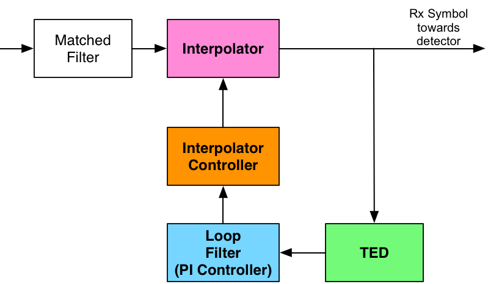

# Symbol Timing Recovery

## Overview
This repository contains MATLAB scripts focusing on symbol timing recovery
algorithms. The implementation is based on the material from the book *"Digital
Communications: A Discrete-Time Approach"* by Michael Rice. If you are new to
the topic, you can check out chapter 8 from this book or access the introductory
tutorial in my
[blog](https://igorfreire.com.br/2016/10/15/symbol-timing-synchronization-tutorial/).

The main script of this repository (file `main.m`) is a simulator of symbol
timing recovery applied to a pulse-shaped PAM/QAM signal under additive white
Gaussian noise (AWGN). This script generates the pulse-shaped Tx sequence and
feeds it into a receiver with the following blocks:

The symbol timing recovery loop is implemented by the `symbolTimingSync`
function and combines the timing error detector (TED), interpolator, controller,
and loop filter blocks. The adopted loop filter is a
proportional-plus-integrator (PI) controller, while the interpolator controller
is a modulo-1 counter. Meanwhile, you can choose the TED and interpolator
implementation from various alternative methods.

When running the simulation, ensure to tune the parameters of interest at the
top of the `main.m` file. For instance, choose the TED scheme and the
interpolation method from the supported options summarized in the table below.
Alternatively, experiment with filter parameters such as the loop bandwidth and
damping factor, or play with plotting and debugging options by enabling the
`debug_tl_static` and `debug_tl_runtime` flags at the top of `main.m`.

| Supported TEDs                 | Supported Interpolators           |
| -------------------------------|-----------------------------------|
| Maximum-likelihood TED (MLTED) | Polyphase filterbank interpolator |
| Early-late TED (ELTED)         | Linear polynomial interpolator    |
| Zero-crossing TED (ZCTED)      | Quadratic polynomial interpolator |
| Gardner TED (GTED)             | Cubic polynomial interpolator     |
| Mueller and Müller TED (MMTED) |                                   |

## Code Organization

| File                        | Description                                           |
| --------------------------- |:------------------------------------------------------|
| `main.m`                    | Main simulation.                                      |
| `symbolTimingSync.m`        | Function implementing the symbol timing recovery loop.|
| `calcTedKp.m`               | Function to compute the timing error detector gain.   |
| `derivativeMf.m`            | Function to compute the derivative matched filter.    |
| `piLoopConstants.m`         | Function to compute the PI controller constants.      |
| `polyphaseFilterBank.m`     | Function to design the polyphase interpolator.        |
| `plotTedGain.m`             | Function to plot the TED gain vs. the rolloff factor. |
| `calcSCurve.m`              | Function to compute the TED's S-curve analytically.   |
| `simSCurve.m`               | Function to simulate the TED's S-curve.               |
| `genTestVector.m`           | Function to generate input/output test vectors.       |
| `sCurveDemo.mlx`            | A demonstration of TED S-curve and gain evaluations.  |

## Experiments

Please refer to the [documentation page](experiments.md) covering relevant
experiments with the symbol timing recovery simulator.

## Contact

If you have any questions or comments, please feel free to e-mail me or open an
issue.